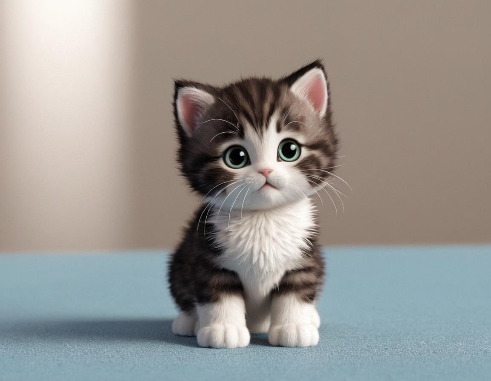

# Gatito

Gatito é um bot para Discord que traz um pouco de diversão com imagens e GIFs de gatos, além de um som de miau! Comandos simples permitem que os usuários recebam uma imagem aleatória de gato, um GIF de gato ou até mesmo um arquivo de áudio com um som de miau.




## Comandos

- `!foto` - Envia uma imagem aleatória de um gato.
- `!gif` - Envia um GIF ou vídeo de um gato.
- `!miau` - Envia um arquivo de áudio com um som de miau.

## Instalação

1. **Clone o repositório:**

   ```bash
   git clone https://github.com/seu_usuario/seu_repositorio.git
   cd seu_repositorio
   ```

2. **(Opcional) Crie um ambiente virtual e ative-o:**

   ```bash
   python -m venv venv
   source venv/bin/activate  # No Windows use `venv\Scripts\activate`
   ```

3. **Instale as dependências:**

   ```bash
   pip install -r requirements.txt
   ```

4. **Configure o bot:**

   Substitua `'Seu_token'` no arquivo `bot.py` com o token do seu bot do Discord.

5. **Execute o bot:**

   ```bash
   python bot.py
   ```

## Dependências

- `discord.py` - Biblioteca para interagir com a API do Discord.
- `requests` - Biblioteca para fazer requisições HTTP.

Você pode instalar essas dependências com o seguinte comando:

```bash
pip install discord.py requests
```

## Contribuição

Este projeto é apenas para diversão e aprendizado. Sinta-se à vontade para explorar e experimentar com o código!
